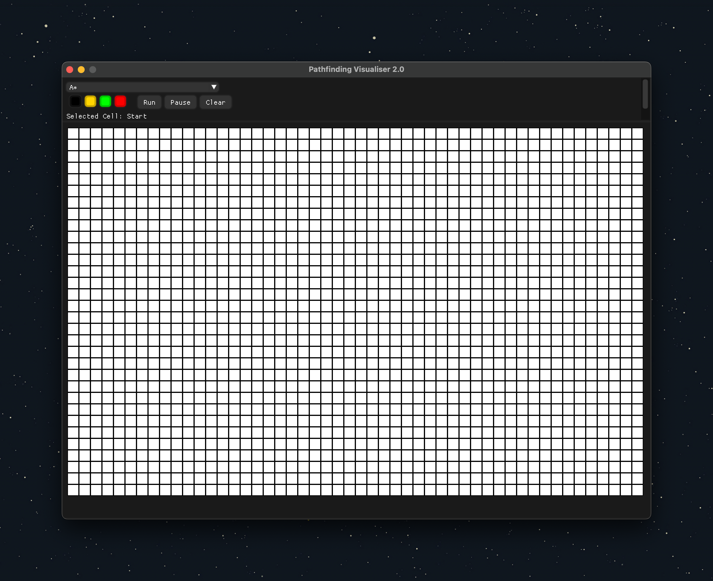
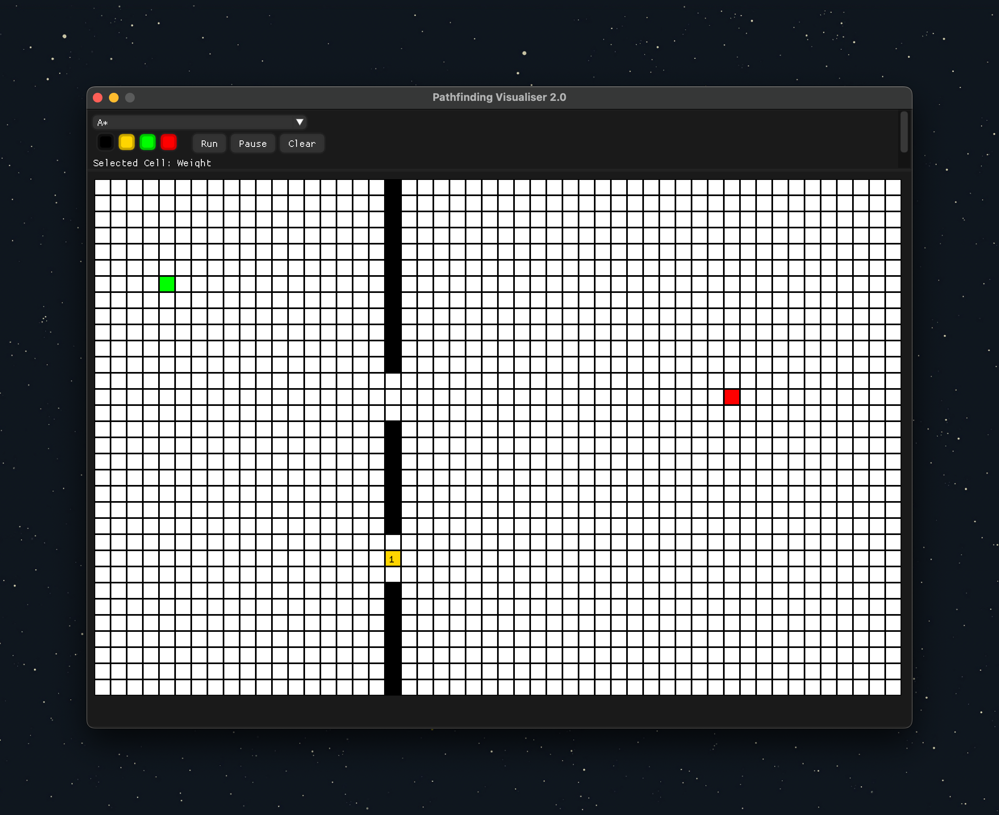
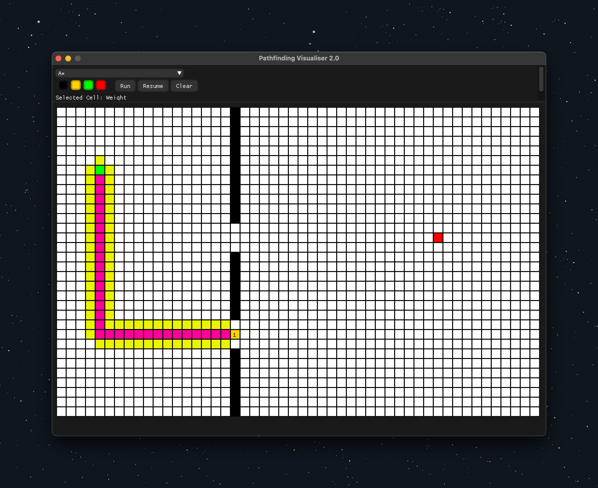
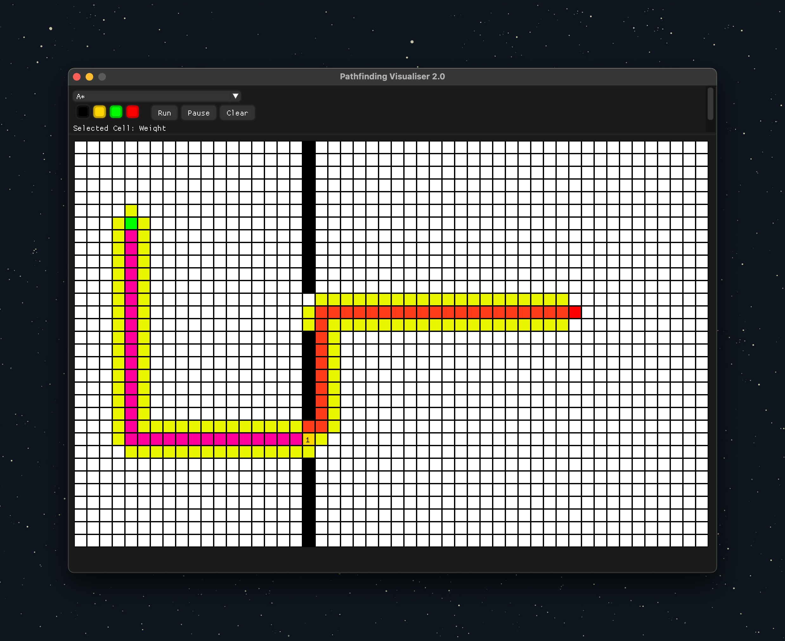

### Advanced Path Finding Visualiser

This is a path finding visualiser that uses A\*, Dijkstra's, Breadth First Search and Depth First Search algorithms to find the shortest path between two points on a grid. The visualiser also allows the user to create walls and move the start and end points to see how the algorithms work in real time.

## Table of Contents

- [Table of Contents](#table-of-contents)
- [Screenshots](#screenshots)
- [Installation ](#installation-)
- [Usage ](#usage-)

## Screenshots

|  |  |
| ---------------------------------- | ---------------------------------- |
|  |  |

## Installation 

1. Clone the repository with `git clone --recursive https://github.com/burakssen/path_finding_visualiser.git`
2. Run `mkdir build && cd build`
3. Run `cmake ..`
4. Run `make`
5. Run `./path_finding_visualiser`

## Usage 

1. Select the algorithm you want to use from the drop down menu.
2. Select cell type from top left corner.
3. Left click on the grid to place cells.
4. Right click on the grid to remove cells.
5. Click on start button to start the algorithm.
6. Click on clear button to clear the grid.
